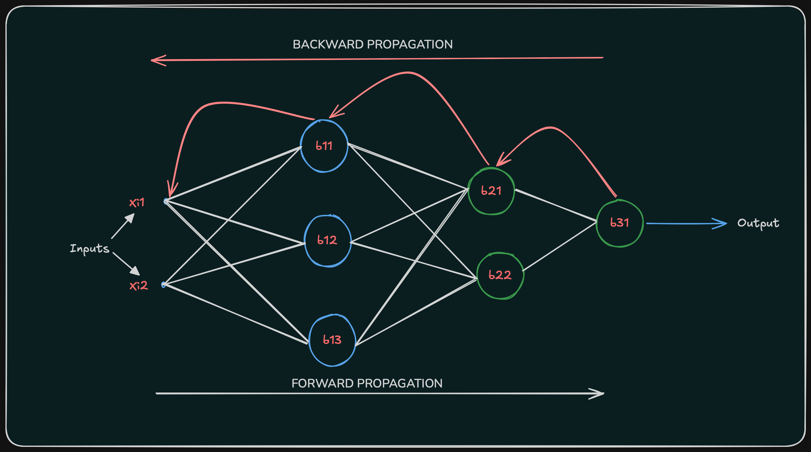
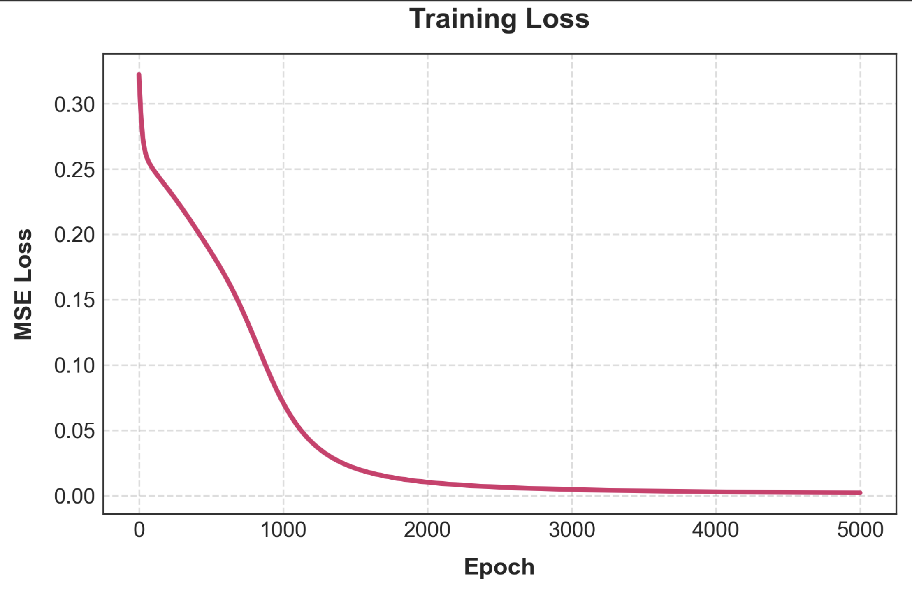
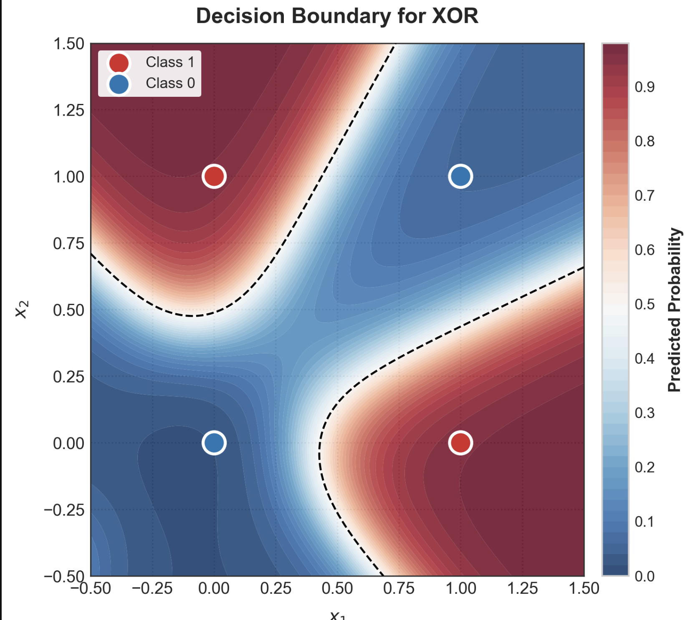

# Neural Network From Scratch (NumPy)

A fully connected neural network implemented from first principles using only **NumPy** — no PyTorch, TensorFlow, or Keras. Every component (forward propagation, backpropagation, gradient descent) is implemented and derived manually, then verified on the XOR problem, a classic example of a non-linearly separable dataset that a linear model cannot solve.

## Motivation

Frameworks reduce training to two lines:

```python
loss.backward()
optimizer.step()
```

That convenience hides the actual mechanics. This project was built to answer questions directly rather than take them on faith:

- How are weights initialized, and why does it matter?
- What does a `Dense` layer actually cache, and why?
- Where does `dW = X.T @ dZ` come from?
- How does a gradient flow backward through an activation function?
- Why can a single-layer (linear) model never solve XOR?

Every layer, activation, and loss function below was derived from the chain rule and implemented without an autograd engine.

## What's Implemented

**Core**
- `Dense` — fully connected layer with manual forward and backward passes
- `Sequential` — chains layers together and routes gradients backward through the network
- `MSE` — mean squared error loss and its gradient
- Batch gradient descent

**Activations** (forward and backward passes for each)
- Sigmoid
- Tanh
- ReLU
- Leaky ReLU
- Softmax (forward pass)

## Repository Structure

```
neural-network-from-scratch/
├── nn/
│   ├── __init__.py
│   ├── dense.py
│   ├── activations.py
│   ├── losses.py
│   └── sequential.py
├── notebooks/
│   └── neural_network_from_scratch.ipynb
├── examples/
│   └── xor_demo.py
├── assets/
│   ├── decision_boundary.png
│   └── training_loss.png
├── README.md
├── requirements.txt
└── LICENSE
```

## How It Works

### Forward propagation

Each `Dense` layer computes:

```
Z = X @ W + B
```

`Z` is then passed through an activation function. The model used for XOR:

```
Input (2) → Dense(2,4) → Tanh → Dense(4,1) → Sigmoid → Prediction
```

### Backpropagation

Gradients are computed via the chain rule and propagated backward through the `Sequential` container. For every `Dense` layer:

```
dW = X.T @ dZ        # gradient w.r.t. weights
dB = sum(dZ)         # gradient w.r.t. bias
dX = dZ @ W.T        # gradient passed to the previous layer
```

Each activation function computes its own local derivative (e.g. `dZ = dA * A * (1 - A)` for Sigmoid) before passing the gradient further back.

### Training loop

```
forward pass → loss → loss gradient → backward pass → weight update → repeat
```

## Usage

```python
from nn import Dense, Tanh, Sigmoid, Sequential, MSE

model = Sequential([
    Dense(2, 4),
    Tanh(),
    Dense(4, 1),
    Sigmoid()
])

loss_fn = MSE()

for epoch in range(epochs):
    prediction = model.forward(X)
    loss = loss_fn.forward(y, prediction)
    gradient = loss_fn.backward()
    model.backward(gradient, learning_rate)
```

## Results

Trained on the XOR dataset (2 inputs, 4-unit hidden layer, 5000 epochs, lr = 0.1):

| Input (x1, x2) | Target | Prediction |
|---|---|---|
| 0, 0 | 0 | 0.021 |
| 0, 1 | 1 | 0.954 |
| 1, 0 | 1 | 0.953 |
| 1, 1 | 0 | 0.057 |

Final loss: **0.0020**, accuracy: **100%**.




The decision boundary plot is the real evidence this works: it shows the model's predicted probability across the *entire* input plane, not just the four training points, and confirms it learned a non-linear (curved) boundary — something a linear classifier cannot produce.

### A note on activation choice

An earlier version used ReLU in the hidden layer. On a network this small, random initialization occasionally left every hidden ReLU unit negative for all four training inputs. Once that happens, the ReLU gradient is zero everywhere, the units "die," and training collapses to predicting a flat 0.5 for every input — visible as loss plateauing at exactly 0.25 (the MSE of guessing 0.5 against two 0s and two 1s). Switching the hidden activation to Tanh, which has a non-zero gradient almost everywhere, removed this failure mode. Leaky ReLU is included in `nn/activations.py` as an alternative fix for the same problem.

## What I Learned

- How forward propagation and backpropagation work as vectorized matrix operations, not just as equations on a whiteboard
- Why intermediate values are cached during the forward pass (they're needed for gradient computation on the backward pass)
- How to derive gradients through the chain rule for both linear layers and activation functions
- How a real training failure mode (dying ReLU) surfaces in practice, and how to diagnose and fix it
- How to structure a small neural network library into reusable, composable modules

## Future Improvements

- Binary cross-entropy and categorical cross-entropy loss, with Softmax backpropagation
- Xavier / He weight initialization
- Adam optimizer
- Mini-batch gradient descent
- Model serialization (save / load trained weights)
- A second, larger benchmark (e.g. MNIST) to test the implementation beyond a 4-sample toy dataset

## Requirements

```
numpy
matplotlib
```

## License

MIT
