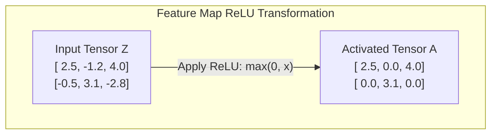
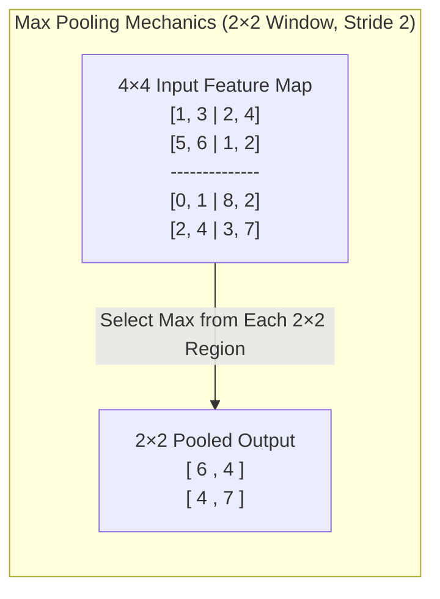
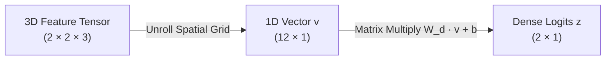
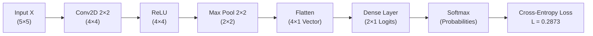
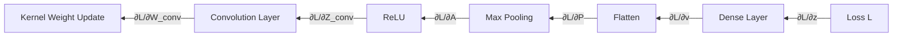
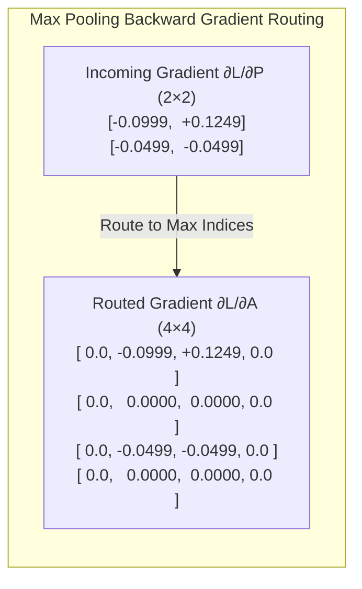
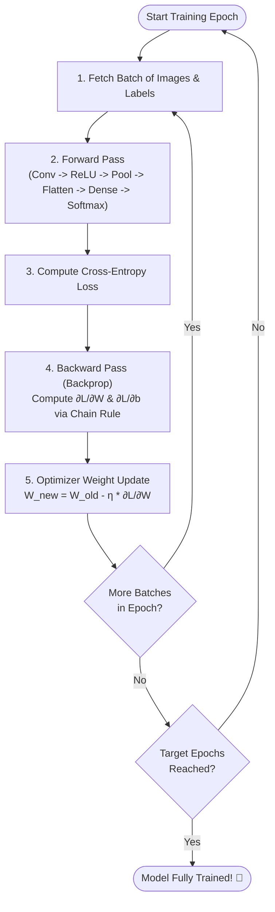
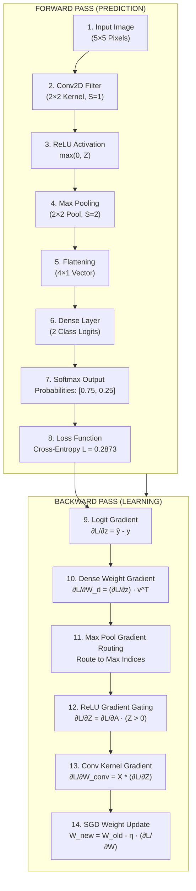

# Convolutional Neural Networks (CNNs): From Absolute Basics to Backpropagation

> A comprehensive, highly visual, and mathematically rigorous guide to understanding how Convolutional Neural Networks see, process, analyze, and learn from images.

---

## Table of Contents

1. [Prerequisites: From Image to Numbers](#1-prerequisites-from-image-to-numbers)
2. [Why ANN Is Not Ideal for Images](#2-why-ann-is-not-ideal-for-images)
3. [The Core Idea Behind CNN](#3-the-core-idea-behind-cnn)
4. [Convolution — The Most Important Concept](#4-convolution--the-most-important-concept)
5. [Why Convolution Works](#5-why-convolution-works)
6. [Multiple Filters and Feature Maps](#6-multiple-filters-and-feature-maps)
7. [CNN Architecture & Shape Mechanics](#7-cnn-architecture--shape-mechanics)
8. [Activation Function — ReLU](#8-activation-function--relu)
9. [Pooling — Spatial Subsampling](#9-pooling--spatial-subsampling)
10. [Flattening and Fully Connected Layers](#10-flattening-and-fully-connected-layers)
11. [Output Layer and Prediction (Softmax)](#11-output-layer-and-prediction-softmax)
12. [Loss Function (Cross-Entropy)](#12-loss-function-cross-entropy)
13. [COMPLETE FORWARD PASS: End-to-End Mini CNN Trace](#13-complete-forward-pass-end-to-end-mini-cnn-trace)
14. [Introduction to Backpropagation](#14-introduction-to-backpropagation)
15. [Backpropagation Through a Dense Layer](#15-backpropagation-through-a-dense-layer)
16. [Backpropagation Through ReLU](#16-backpropagation-through-relu)
17. [Backpropagation Through Max Pooling](#17-backpropagation-through-max-pooling)
18. [BACKPROPAGATION THROUGH CONVOLUTION](#18-backpropagation-through-convolution)
19. [Gradient Descent and Weight Update](#19-gradient-descent-and-weight-update)
20. [COMPLETE CNN TRAINING LOOP](#20-complete-cnn-training-loop)
21. [Final "CNN in One Picture"](#21-final-cnn-in-one-picture)

---

# 1. Prerequisites: From Image to Numbers

To a human, an image is a visual scene composed of shapes, light, and colors. To a computer, an image is purely a **multi-dimensional array of numbers (a tensor)**.

### Pixels and Pixel Values

Every digital image is split into a grid of tiny square units called **pixels** (picture elements). 
* In a standard 8-bit digital representation, each pixel's intensity is expressed as an integer between `0` and `255`.
* `0` represents complete absence of light (**pure black**).
* `255` represents maximum intensity (**pure white**).
* Values between `1` and `254` represent shades of gray or color intensity.

### Grayscale vs. RGB Color Tensors

An image's tensor rank depends on its color model:

1. **Grayscale Image ($2\text{D}$ Matrix / $3\text{D}$ Tensor with $C=1$):**
   A grayscale image has only 2 spatial dimensions: $\text{Height} \times \text{Width}$.
   * Example: A $28 \times 28$ MNIST digit is represented by a tensor of shape $(28, 28, 1)$ or $(1, 28, 28)$. Total pixels = $784$.

2. **RGB Color Image ($3\text{D}$ Tensor with $C=3$):**
   A color image is created by stacking three distinct color channels: **Red**, **Green**, and **Blue**.
   * Example: A standard ImageNet sample of $224 \times 224 \times 3$ has $224$ pixels in height, $224$ pixels in width, and $3$ stacked color matrices. Total numbers = $224 \times 224 \times 3 = 150,528$.

$$\text{Image Tensor Shape} = (\text{Batch Size } N, \text{ Height } H, \text{ Width } W, \text{ Channels } C)$$

> [!NOTE]
> During neural network preprocessing, integer values in $[0, 255]$ are typically normalized to real numbers in $[0.0, 1.0]$ or $[-1.0, 1.0]$ by dividing by $255.0$. This prevents gradient explosions during neural network training.

---

# 2. Why ANN Is Not Ideal for Images

Before CNNs, standard Artificial Neural Networks (Dense / Fully Connected Networks) were used for machine learning tasks. However, applying dense layers directly to raw image tensors introduces major failures.

### Visual Comparison: ANN vs. CNN

### Three Major Limitations of Standard ANNs for Images

#### 1. Destruction of Spatial Structure (Loss of 2D Context)
Images possess **spatial locality**: neighboring pixels are strongly correlated and jointly define visual features (edges, contours, textures). Flattening breaks 2D adjacency. A pixel at position $(1, 28)$ was originally adjacent to $(2, 28)$, but in a flattened vector, they are separated by 28 elements, severing their spatial relationship.

#### 2. Parameter Explosion
In a fully connected layer, every input unit connects to every neuron in the next layer.
* For a modest $224 \times 224 \times 3$ image ($150,528$ inputs) connected to a hidden layer of just $1,024$ neurons:
$$\text{Parameters} = W + b = (150,528 \times 1,024) + 1,024 = 154,141,696 \quad (\approx 154 \text{ Million weights!})$$
This leads to severe memory exhaustion, high computational overhead, and extreme overfitting.

#### 3. Lack of Translation Invariance
If an ANN learns to recognize a dog located at the **top-left** of an image, the learned weights are tied specifically to the input vector indices corresponding to the top-left pixels. If the exact same dog appears in the **bottom-right**, the network fails to recognize it because the activations land on completely different input nodes.

---

# 3. The Core Idea Behind CNN

The foundational intuition behind a Convolutional Neural Network is **hierarchical feature extraction**. 

Instead of looking at the entire image all at once, a CNN inspects tiny local sub-regions (receptive fields) using small, learnable matrix windows. 

> [!TIP]
> **Key Takeaway:** Early CNN layers answer: *"Is there an edge here?"* Middle layers answer: *"Do these edges form a circle or triangle?"* Deep layers answer: *"Do these shapes form a cat's ear or a wheel?"*

---

# 4. Convolution — The Most Important Concept

The **convolution operation** is the fundamental building block of a CNN. Mathematically, it applies a spatial dot product between a small weight matrix called a **kernel (or filter)** and a local region of the input image, sliding across the entire grid.

### Core Terminology

* **Input ($X$):** The input tensor of shape $(H \times W)$.
* **Kernel / Filter ($W$):** A small learnable weight matrix of shape $(f_h \times f_w)$ (typically $3 \times 3$ or $5 \times 5$).
* **Stride ($S$):** The step size (in pixels) by which the filter slides across the input image.
* **Padding ($P$):** Extra rows/columns of zeros added to the image border to control output spatial dimensions and retain edge information.
* **Feature Map ($Z$):** The output matrix produced by sliding the filter over the input image.

### Mathematical Equation of 2D Convolution

For an input $X$ and kernel $W$ with bias $b$:

$$Z_{i, j} = \left( \sum_{m=0}^{f_h-1} \sum_{n=0}^{f_w-1} X_{i \cdot S + m, \; j \cdot S + n} \cdot W_{m, n} \right) + b$$

### Calculating Output Dimensions

Given an input of shape $H \times W$, filter size $f$, padding $P$, and stride $S$, the output feature map dimension $H_{out} \times W_{out}$ is:

$$H_{out} = \left\lfloor \frac{H - f + 2P}{S} \right\rfloor + 1, \qquad W_{out} = \left\lfloor \frac{W - f + 2P}{S} \right\rfloor + 1$$

---

### Step-by-Step Numerical Convolution Example

Let us convolve a $5 \times 5$ grayscale input image with a $3 \times 3$ kernel ($S=1, P=0$).

$$\text{Input } X \; (5 \times 5) = 
\begin{bmatrix} 
1 & 1 & 1 & 0 & 0 \\ 
0 & 1 & 1 & 1 & 0 \\ 
0 & 0 & 1 & 1 & 1 \\ 
0 & 0 & 1 & 1 & 0 \\ 
0 & 1 & 1 & 0 & 0 
\end{bmatrix}, \qquad 
\text{Kernel } W \; (3 \times 3) = 
\begin{bmatrix} 
1 & 0 & 1 \\ 
0 & 1 & 0 \\ 
1 & 0 & 1 
\end{bmatrix}, \quad b = 0$$

Output shape calculation: $H_{out} = \frac{5 - 3 + 0}{1} + 1 = 3 \implies 3 \times 3 \text{ Feature Map}$.

* **Position (0,0):** Top-left window dot product: $(1\cdot 1) + (1\cdot 0) + (1\cdot 1) + (0\cdot 0) + (1\cdot 1) + (1\cdot 0) + (0\cdot 1) + (0\cdot 0) + (1\cdot 1) = \mathbf{4}$
* **Position (0,1):** Shift 1 pixel right: $(1\cdot 1) + (1\cdot 0) + (0\cdot 1) + (1\cdot 0) + (1\cdot 1) + (1\cdot 0) + (0\cdot 1) + (1\cdot 0) + (1\cdot 1) = \mathbf{3}$

Continuing this sliding window step-by-step yields the final **Feature Map $Z$**:

$$Z = \begin{bmatrix} 4 & 3 & 3 \\ 2 & 4 & 3 \\ 2 & 3 & 4 \end{bmatrix}$$

---

# 5. Why Convolution Works

Why is sliding a matrix over an image so effective? Because **a kernel acts as a pattern matching detector**.

### Conceptual Edge Detection Filters

Consider these classical hand-designed image processing filters:

$$\text{Vertical Edge Filter } W_v = \begin{bmatrix} -1 & 0 & 1 \\ -1 & 0 & 1 \\ -1 & 0 & 1 \end{bmatrix}, \qquad 
\text{Horizontal Edge Filter } W_h = \begin{bmatrix} -1 & -1 & -1 \\ 0 & 0 & 0 \\ 1 & 1 & 1 \end{bmatrix}$$

If an image region contains a bright vertical stripe adjacent to a dark vertical stripe:
* Left column pixels $\approx 255$ (bright)
* Right column pixels $\approx 0$ (dark)

Applying $W_v$ to this region produces a high output magnitude ($\gg 0$), signaling **"Vertical Edge Detected!"**
If the region is uniform (all pixels equal to $100$), the dot product yields **$0$**, signaling **"No Edge Detected."**

> [!IMPORTANT]
> **Forward Pass vs. Backpropagation:**
> * **Forward Pass:** The filter acts as a fixed pattern template detector on the input tensor.
> * **Backpropagation:** The filter values are **NOT** hardcoded. They start as random numbers and are automatically learned and refined by gradient descent to minimize error.

---

# 6. Multiple Filters and Feature Maps

A single filter can only detect **one specific type of feature** (e.g., vertical edges). To extract a rich set of visual primitives (vertical edges, horizontal edges, color transitions, textures), a convolutional layer uses **multiple filters in parallel**.

### 1 Filter $\rightarrow$ 1 Feature Map Channel

If a convolutional layer has $K$ filters, it produces an output tensor with $K$ channels.

$$\text{Single Filter Shape} = (f_h \times f_w \times C_{in})$$

#### How 3D Convolution Works:
1. Filter Channel 1 convolves with Input Channel 1 (Red).
2. Filter Channel 2 convolves with Input Channel 2 (Green).
3. Filter Channel 3 convolves with Input Channel 3 (Blue).
4. The three resulting 2D spatial matrices are **summed element-wise**, and a scalar bias $b$ is added.

$$\text{Output Spatial Slice } Z_{:,:,k} = \left( \sum_{c=1}^{C_{in}} X_{:,:,c} * W_{:,:,c, k} \right) + b_k$$

$$\text{Layer Weights Shape} = (f_h \times f_w \times C_{in} \times C_{out})$$

---

# 7. CNN Architecture & Shape Mechanics

A complete Convolutional Neural Network alternates between **Convolutional Layers**, **Activation Functions (ReLU)**, **Pooling Layers**, and finally **Dense Layers**.

### Architecture Transformation Pipeline

```mermaid
flowchart LR
    Input["Input Image<br/>(28×28×1)"] --> Conv1["Conv 3×3 (8 filters)<br/>(26×26×8)"]
    Conv1 --> ReLU1["ReLU<br/>(26×26×8)"]
    ReLU1 --> Pool1["Max Pool 2×2 (stride 2)<br/>(13×13×8)"]
    Pool1 --> Conv2["Conv 3×3 (16 filters)<br/>(11×11×16)"]
    Conv2 --> Pool2["Max Pool 2×2 (stride 2)<br/>(5×5×16)"]
    Pool2 --> Flatten["Flatten<br/>(400×1 Vector)"]
    Flatten --> FC1["Dense Layer<br/>(128 Neurons)"]
    FC1 --> Output["Softmax Output<br/>(10 Classes)"]
```

### Comprehensive Shape & Parameter Tracking Table

Let's trace a $28 \times 28 \times 1$ grayscale image through this standard CNN architecture:

| Layer # | Layer Type | Kernel / Stride / Pad | Formula for Output Dimensions | Output Tensor Shape $(H \times W \times C)$ | Parameter Calculation | Total Learnable Parameters |
| :--- | :--- | :--- | :--- | :--- | :--- | :--- |
| **0** | **Input** | — | — | $(28 \times 28 \times 1)$ | None | $0$ |
| **1** | **Conv2D_1** | $f=3, S=1, P=0, K=8$ | $\lfloor\frac{28-3+0}{1}\rfloor+1 = 26$ | $(26 \times 26 \times 8)$ | $(3 \times 3 \times 1 \times 8) + 8$ | **$80$** |
| **2** | **ReLU_1** | Element-wise | Preserves Shape | $(26 \times 26 \times 8)$ | Activation (No parameters) | $0$ |
| **3** | **MaxPool_1**| $f=2, S=2, P=0$ | $\lfloor\frac{26-2+0}{2}\rfloor+1 = 13$ | $(13 \times 13 \times 8)$ | Subsampling (No parameters)| $0$ |
| **4** | **Conv2D_2** | $f=3, S=1, P=0, K=16$| $\lfloor\frac{13-3+0}{1}\rfloor+1 = 11$ | $(11 \times 11 \times 16)$| $(3 \times 3 \times 8 \times 16) + 16$| **$1,168$** |
| **5** | **MaxPool_2**| $f=2, S=2, P=0$ | $\lfloor\frac{11-2+0}{2}\rfloor+1 = 5$ | $(5 \times 5 \times 16)$ | Subsampling (No parameters)| $0$ |
| **6** | **Flatten** | 3D $\to$ 1D Vector | $5 \times 5 \times 16 = 400$ | $(400 \times 1)$ | Reshape (No parameters) | $0$ |
| **7** | **Dense_1** | Fully Connected | Output Neurons = $128$ | $(128 \times 1)$ | $(400 \times 128) + 128$ | **$51,328$** |
| **8** | **Output** | Softmax Dense | Output Neurons = $10$ | $(10 \times 1)$ | $(128 \times 10) + 10$ | **$1,290$** |

$$\text{Total Network Parameters} = 80 + 1,168 + 51,328 + 1,290 = \mathbf{53,866}$$

---

# 8. Activation Function — ReLU

Convolution is a purely linear transformation (matrix multiplications and additions). Stacking multiple linear layers without nonlinearities is mathematically equivalent to a single linear layer: $W_2(W_1 X) = (W_2 W_1)X = W_{net}X$.

To learn complex visual patterns, we must inject non-linearity after every convolution.

### Rectified Linear Unit (ReLU)

$$\text{ReLU}(x) = \max(0, x)$$

### Why ReLU is Preferred Over Sigmoid/Tanh
1. **Computational Efficiency:** Requires simple thresholding at zero ($\max(0, x)$), which is fast to compute.
2. **Mitigates Vanishing Gradients:** The derivative of ReLU is $1$ for all positive inputs ($x > 0$), allowing gradients to flow back through deep networks without shrinking exponentially.

---

# 9. Pooling — Spatial Subsampling

The **Pooling Layer** shrinks the spatial height and width ($H \times W$) of feature maps while retaining depth ($C$).

### Objectives of Pooling
1. **Dimensionality Reduction:** Reduces memory consumption and computational complexity for subsequent layers.
2. **Translation Equivariance / Small Invariance:** Slight shifts in feature positions do not change pooled outputs.

### Max Pooling ($2 \times 2$ Pool, Stride 2)

$$\begin{bmatrix} 
\mathbf{1} & \mathbf{3} & 2 & 4 \\ 
\mathbf{5} & \mathbf{6} & 1 & 2 \\ 
0 & 1 & \mathbf{8} & \mathbf{2} \\ 
2 & 4 & \mathbf{3} & \mathbf{7} 
\end{bmatrix} 
\xrightarrow{\text{Max Pool 2×2, Stride 2}} 
\begin{bmatrix} 
\max(1,3,5,6) & \max(2,4,1,2) \\ 
\max(0,1,2,4) & \max(8,2,3,7) 
\end{bmatrix} = 
\begin{bmatrix} 
\mathbf{6} & \mathbf{4} \\ 
\mathbf{4} & \mathbf{7} 
\end{bmatrix}$$

> [!NOTE]
> Pooling operates **independently on each channel channel-by-channel**. If the input has shape $(H, W, C)$, max pooling with size $2 \times 2$ and stride $2$ yields an output shape of $(\frac{H}{2}, \frac{W}{2}, C)$.

---

# 10. Flattening and Fully Connected Layers

After extracting multi-scale 2D features through alternating Convolution, ReLU, and Pooling layers, high-level structural features are preserved in the channel dimensions of a small spatial feature map.

To convert these 3D spatial feature tensors into final class predictions:

1. **Flattening:** Unrolls the 3D tensor of shape $(H_{final}, W_{final}, C_{final})$ into a 1D column vector of size $M = H_{final} \cdot W_{final} \cdot C_{final}$.
2. **Dense Layer:** Multiplies the flattened vector by a weight matrix $W_{dense}$ to combine all extracted features across the entire image field.

---

# 11. Output Layer and Prediction (Softmax)

For multi-class classification, the final dense layer produces unnormalized real-valued logit scores $z = [z_1, z_2, \dots, z_K]^T$ for $K$ target classes.

To convert logits into a valid probability distribution where $0 \le \hat{y}_k \le 1$ and $\sum_{k=1}^K \hat{y}_k = 1$, we apply the **Softmax Activation Function**:

$$\hat{y}_k = \text{Softmax}(z)_k = \frac{e^{z_k}}{\sum_{j=1}^K e^{z_j}}$$

### Numerical Softmax Example

Suppose a CNN outputs raw logits $z = [2.0, 1.0, 0.1]^T$ for 3 classes: `[Cat, Dog, Bird]`.

1. Compute Exponentials: $e^{2.0} \approx 7.389, \quad e^{1.0} \approx 2.718, \quad e^{0.1} \approx 1.105$
2. Sum of Exponentials: $\sum e^{z_j} = 7.389 + 2.718 + 1.105 = 11.212$
3. Compute Softmax Probabilities $\hat{y}$:
   * $\hat{y}_{\text{Cat}} = \frac{7.389}{11.212} = \mathbf{0.659} \quad (65.9\%)$
   * $\hat{y}_{\text{Dog}} = \frac{2.718}{11.212} = \mathbf{0.242} \quad (24.2\%)$
   * $\hat{y}_{\text{Bird}} = \frac{1.105}{11.212} = \mathbf{0.099} \quad (9.9\%)$

$$\sum_{k=1}^3 \hat{y}_k = 0.659 + 0.242 + 0.099 = \mathbf{1.000} \quad (100\%)$$

---

# 12. Loss Function (Categorical Cross-Entropy)

To evaluate how well the CNN performs, we compare its predicted probability distribution $\hat{y}$ against the ground-truth one-hot encoded vector $y$.

### Categorical Cross-Entropy Formula

$$L(y, \hat{y}) = - \sum_{k=1}^K y_k \ln(\hat{y}_k)$$

Since $y$ is a one-hot vector where $y_c = 1$ for the true class $c$ and $y_k = 0$ for all $k \neq c$, the formula simplifies to:

$$L = - \ln(\hat{y}_c)$$

### Numerical Loss Calculation
* If True Class = `Cat` ($y = [1, 0, 0]^T$) and $\hat{y}_{\text{Cat}} = 0.659$:
$$L = - \ln(0.659) \approx \mathbf{0.417}$$
* If the network confidently misclassified `Cat` with $\hat{y}_{\text{Cat}} = 0.01$:
$$L = - \ln(0.01) \approx \mathbf{4.605} \quad (\text{High penalty!})$$

---

# 13. COMPLETE FORWARD PASS

Let's now execute an **end-to-end forward pass on a mini CNN**. We will track every tensor dimension and value through each step.

### Forward Pass Dataflow Pipeline

#### 1. Input Image $X$ ($5 \times 5$)

$$X = \begin{bmatrix} 
1.0 & 2.0 & 0.0 & 1.0 & 1.0 \\ 
0.0 & 1.0 & 3.0 & 2.0 & 0.0 \\ 
2.0 & 0.0 & 1.0 & 0.0 & 1.0 \\ 
1.0 & 3.0 & 2.0 & 1.0 & 0.0 \\ 
0.0 & 1.0 & 0.0 & 2.0 & 1.0 
\end{bmatrix}$$

#### 2. Conv Filter Weights $W_{conv}$ ($2 \times 2$) & Bias $b=0$

$$W_{conv} = \begin{bmatrix} 1.0 & -1.0 \\ 2.0 & 0.0 \end{bmatrix}$$

Sliding $W_{conv}$ across $X$ with stride 1 produces $Z_{conv}$ of shape $(4 \times 4)$:

$$Z_{conv} = \begin{bmatrix} 
-1.0 & 4.0 & 5.0 & 4.0 \\ 
3.0 & -2.0 & 3.0 & 2.0 \\ 
4.0 & 5.0 & 5.0 & 1.0 \\ 
-2.0 & 3.0 & 1.0 & 5.0 
\end{bmatrix}$$

#### 3. ReLU Activation $A_{conv} = \max(0, Z_{conv})$ ($4 \times 4$)

$$A_{conv} = \begin{bmatrix} 
0.0 & 4.0 & 5.0 & 4.0 \\ 
3.0 & 0.0 & 3.0 & 2.0 \\ 
4.0 & 5.0 & 5.0 & 1.0 \\ 
0.0 & 3.0 & 1.0 & 5.0 
\end{bmatrix}$$

#### 4. Max Pooling $P$ ($2 \times 2$ pool, Stride 2) $\to$ Output Shape $(2 \times 2)$

$$P = \begin{bmatrix} 4.0 & 5.0 \\ 5.0 & 5.0 \end{bmatrix}$$

#### 5. Flattening $\to$ Vector $v$ ($4 \times 1$)

$$v = \begin{bmatrix} 4.0 & 5.0 & 5.0 & 5.0 \end{bmatrix}^T$$

#### 6. Dense Layer $\to$ Logits $z$ ($2 \times 1$)

Dense weight matrix $W_d$ ($2 \times 4$) and bias $b_d = [0.0, 0.0]^T$:

$$W_d = \begin{bmatrix} 0.5 & -0.2 & 0.1 & 0.4 \\ 0.1 & 0.3 & -0.1 & 0.2 \end{bmatrix}$$

$$z = W_d \cdot v + b_d = \begin{bmatrix} 3.5 \\ 2.4 \end{bmatrix}$$

#### 7. Softmax & Cross-Entropy Loss

* $\hat{y}_0 = \mathbf{0.7503} \quad (\text{Cat}), \qquad \hat{y}_1 = \mathbf{0.2497} \quad (\text{Dog})$
* With ground-truth $y = [1, 0]^T$ (`Cat`):

$$\text{Loss } L = - \ln(\hat{y}_0) = - \ln(0.7503) = \mathbf{0.2873}$$

---

# 14. Introduction to Backpropagation

Forward propagation calculates the network's prediction and loss. **Backpropagation** calculates the gradient of the loss function with respect to every learnable weight and bias in the network using the **Multivariate Chain Rule**.

---

# 15. Backpropagation Through a Dense Layer

Consider a dense linear transformation $z = W_d \cdot v + b_d$.

### Gradient of Loss with respect to Logits ($\frac{\partial L}{\partial z}$)

$$\frac{\partial L}{\partial z} = \hat{y} - y = \begin{bmatrix} 0.7503 \\ 0.2497 \end{bmatrix} - \begin{bmatrix} 1.0 \\ 0.0 \end{bmatrix} = \begin{bmatrix} -0.2497 \\ +0.2497 \end{bmatrix}$$

### 1. Weight Gradient ($\frac{\partial L}{\partial W_d}$)

$$\frac{\partial L}{\partial W_d} = \left(\frac{\partial L}{\partial z}\right) \cdot v^T = \begin{bmatrix} -0.9989 & -1.2487 & -1.2487 & -1.2487 \\ +0.9989 & +1.2487 & +1.2487 & +1.2487 \end{bmatrix}$$

### 2. Input Gradient ($\frac{\partial L}{\partial v}$) to pass backward

$$\frac{\partial L}{\partial v} = W_d^T \cdot \left(\frac{\partial L}{\partial z}\right) = \begin{bmatrix} -0.0999 \\ +0.1249 \\ -0.0499 \\ -0.0499 \end{bmatrix}$$

---

# 16. Backpropagation Through ReLU

ReLU is defined as $A = \max(0, Z)$. Its derivative with respect to input $Z$ is:

$$\frac{\partial A}{\partial Z} = \begin{cases} 1 & \text{if } Z > 0 \\ 0 & \text{if } Z \le 0 \end{cases}$$

By the element-wise Chain Rule:

$$\frac{\partial L}{\partial Z} = \frac{\partial L}{\partial A} \odot \mathbb{I}(Z > 0)$$

> [!TIP]
> **Gradient Gating:** If a neuron was inactive during the forward pass ($Z \le 0$), its derivative is $0$, completely blocking the backward gradient flow for that element.

---

# 17. Backpropagation Through Max Pooling

Max pooling contains no learnable parameters. Its sole function during backpropagation is to **route the incoming gradient back to the precise spatial location that produced the maximum value during the forward pass**. All non-maximum locations receive a gradient of $0$.

$$\frac{\partial L}{\partial Z_{conv}} = \begin{bmatrix} 
0.0 & -0.0999 & +0.1249 & 0.0 \\ 
0.0 & 0.0 & 0.0 & 0.0 \\ 
0.0 & -0.0499 & -0.0499 & 0.0 \\ 
0.0 & 0.0 & 0.0 & 0.0 
\end{bmatrix}$$

---

# 18. BACKPROPAGATION THROUGH CONVOLUTION

This is the mathematical core of CNN learning. We need to compute:
1. **The Kernel Gradient ($\frac{\partial L}{\partial W_{conv}}$):** To update the filter weights.
2. **The Bias Gradient ($\frac{\partial L}{\partial b}$):** To update the bias.

### 1. Derivation of Filter Weight Gradient ($\frac{\partial L}{\partial W_{conv}}$)

Applying the Multivariate Chain Rule across all output locations $(i,j)$:

$$\frac{\partial L}{\partial W_{m,n}} = \sum_{i} \sum_{j} X_{i+m, j+n} \cdot \frac{\partial L}{\partial Z_{i,j}}$$

> [!IMPORTANT]
> **Key Insight:** The gradient of the loss with respect to the filter weights is computed by **convolving the input image $X$ with the output gradient matrix $\frac{\partial L}{\partial Z}$!**

$$\frac{\partial L}{\partial W_{conv}} = X * \left(\frac{\partial L}{\partial Z_{conv}}\right)$$

### Numerical Kernel Gradient Matrix:

$$\frac{\partial L}{\partial W_{conv}} = \begin{bmatrix} -0.2497 & +0.0749 \\ +0.0250 & -0.1996 \end{bmatrix}$$

### 2. Bias Gradient ($\frac{\partial L}{\partial b}$)

$$\frac{\partial L}{\partial b} = \sum_{i} \sum_{j} \frac{\partial L}{\partial Z_{i,j}} = -0.0999 + 0.1249 - 0.0499 - 0.0499 = \mathbf{-0.0748}$$

---

# 19. Gradient Descent and Weight Update

With gradients calculated for every parameter, we use **Stochastic Gradient Descent (SGD)** to update the weights.

$$W^{\text{new}} = W^{\text{old}} - \eta \cdot \frac{\partial L}{\partial W}, \qquad b^{\text{new}} = b^{\text{old}} - \eta \cdot \frac{\partial L}{\partial b}$$

### Numerical Weight Updates ($\eta = 0.1$)

#### 1. Convolutional Kernel Update:

$$W_{conv}^{\text{new}} = \begin{bmatrix} 1.0 & -1.0 \\ 2.0 & 0.0 \end{bmatrix} - 0.1 \cdot \begin{bmatrix} -0.2497 & +0.0749 \\ +0.0250 & -0.1996 \end{bmatrix} = \begin{bmatrix} \mathbf{1.0250} & \mathbf{-1.0075} \\ \mathbf{1.9975} & \mathbf{0.0200} \end{bmatrix}$$

#### 2. Convolutional Bias Update:

$$b^{\text{new}} = 0.0 - 0.1 \cdot (-0.0748) = \mathbf{+0.0075}$$

#### 3. Dense Weight Matrix Update:

$$W_d^{\text{new}} = \begin{bmatrix} \mathbf{0.6000} & \mathbf{-0.0751} & \mathbf{0.2249} & \mathbf{0.5249} \\ \mathbf{0.0001} & \mathbf{0.1751} & \mathbf{-0.2249} & \mathbf{0.0751} \end{bmatrix}$$

---

# 20. COMPLETE CNN TRAINING LOOP

Training a CNN consists of repeating the forward pass, loss calculation, backpropagation, and weight update across batches of data over multiple epochs.

---

# 21. Final "CNN in One Picture"

---

## Summary of Core Concepts

| Question | Clear & Concise Answer |
| :--- | :--- |
| **What is an image to a CNN?** | A multi-dimensional numerical array (tensor) of pixel intensities in range $[0, 255]$ or $[0.0, 1.0]$. |
| **Why are CNNs better than ANNs for images?** | CNNs preserve 2D spatial relationships, drastically cut parameters via weight sharing, and achieve translation invariance. |
| **What is a filter/kernel?** | A small matrix of learnable weights that slides across the image to extract visual features (edges, textures, shapes). |
| **What is a feature map?** | The 2D matrix produced by convolving a filter over an input tensor, representing spatial feature activations. |
| **Why do we need multiple filters?** | Each filter learns to detect a distinct visual feature (e.g., Filter 1 = vertical edges, Filter 2 = horizontal edges). |
| **Why is ReLU activation used?** | Introduces non-linearity so the network can model complex shapes, while avoiding vanishing gradients for positive activations. |
| **Why do we use Pooling?** | Reduces spatial height and width ($H \times W$) to lower computational cost and provide small translation invariance. |
| **Why do we flatten?** | Converts 3D spatial feature tensors into a 1D vector so standard fully connected layers can combine features for classification. |
| **How does a CNN output predictions?** | The final dense layer produces logits $z$, which Softmax turns into probabilities summing to $1.0$. |
| **What is Cross-Entropy Loss?** | Measures the divergence between predicted class probabilities and ground-truth one-hot labels, penalizing wrong confident guesses. |
| **How does Backpropagation update CNN filters?** | Computes the derivative of loss with respect to filter weights ($\frac{\partial L}{\partial W} = X * \frac{\partial L}{\partial Z}$) via the chain rule, allowing SGD to update weights ($W^{\text{new}} = W^{\text{old}} - \eta \frac{\partial L}{\partial W}$). |
