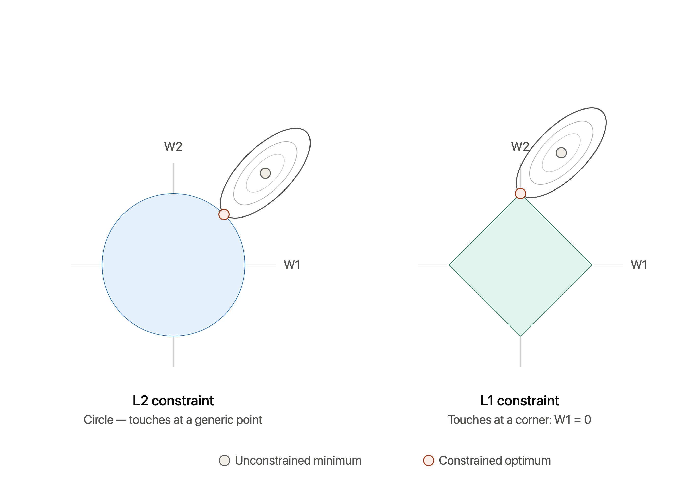

# L1 vs L2 regularization — geometric intuition + reference notes

## The core idea

Regularization adds a penalty on the weights so the model can't just minimize
training loss by blowing up coefficients. Instead of minimizing loss alone,
you minimize:

```
Loss(W) + λ · penalty(W)
```

This is equivalent to minimizing `Loss(W)` subject to a **constraint region**
on `W` — a circle for L2, a diamond for L1. "Optimal" means: the point inside
that region where the loss is lowest.

## Geometric picture



- The **gray dot** is the unconstrained minimum — where the loss alone is
  smallest, ignoring the penalty. You're not allowed to land here unless it
  already happens to sit inside the constraint region.
- The loss contours (the nested ellipses) are level sets — every point on one
  ellipse has equal loss. As you move outward from the gray dot, loss
  increases.
- The **coral dot** is the constrained optimum — the first point where a loss
  contour touches the constraint region. That's the actual solution you get
  after regularization.

**L2 (circle):** smooth boundary, no corners. The ellipse can touch it
anywhere, so the touch point generically has both `W1 ≠ 0` and `W2 ≠ 0`.
Weights shrink toward zero but rarely land exactly on it.

**L1 (diamond):** has sharp corners sitting exactly on the axes. Because
loss ellipses are elongated, it's much more likely that the first contact
happens at a corner rather than flush against a flat edge. Landing on a
corner means one weight is exactly `0` — that's where sparsity comes from.

## Formal definitions

| | L2 (Ridge) | L1 (Lasso) |
|---|---|---|
| Penalty term | `λ · Σ Wᵢ²` | `λ · Σ \|Wᵢ\|` |
| Constraint region | `Σ Wᵢ² ≤ c` (ball) | `Σ \|Wᵢ\| ≤ c` (cross-polytope) |
| Gradient of penalty | `2λWᵢ` — shrinks proportionally to the weight's size | `λ · sign(Wᵢ)` — constant magnitude, regardless of size |
| Effect on weights | Shrinks all weights smoothly toward 0 | Pushes some weights to exactly 0 |
| Resulting model | Dense — uses all features, just smaller weights | Sparse — effectively does feature selection |
| Differentiable at 0? | Yes | No (kink at 0 — needs subgradient methods) |
| Closed-form solution? | Yes (linear regression + L2 = ridge has closed form) | No — needs iterative solvers (coordinate descent, LARS) |

## Why the gradient shape matters

This is the algebraic version of the geometric picture above:

- **L2's gradient is `2λW`** — it shrinks as `W` shrinks. As a weight
  approaches 0, the pull toward 0 gets weaker and weaker, so it asymptotically
  approaches zero but essentially never actually reaches it in continuous
  optimization.
- **L1's gradient is `λ · sign(W)`**, a constant push of the same size no
  matter how small `W` is. That constant pressure can actually walk a weight
  all the way to exactly 0 and keep it there, because there's no proportional
  weakening near zero the way L2 has.

## When to use which

- **Use L2 (Ridge)** when you believe most features are at least a little
  useful and you mainly want to control overfitting / multicollinearity. It's
  the default choice for most regression and NN weight decay.
- **Use L1 (Lasso)** when you suspect many features are irrelevant and you
  want automatic feature selection baked into training, or when
  interpretability from a sparse model matters.
- **Elastic Net** combines both: `λ₁ Σ|Wᵢ| + λ₂ Σ Wᵢ²`. Useful when features
  are correlated — pure L1 tends to arbitrarily pick one of a correlated
  group and zero out the rest, which Elastic Net stabilizes.

## sklearn quick reference

```python
from sklearn.linear_model import Ridge, Lasso, ElasticNet

ridge = Ridge(alpha=1.0)         # L2, alpha = λ
lasso = Lasso(alpha=1.0)         # L1, alpha = λ
enet  = ElasticNet(alpha=1.0, l1_ratio=0.5)  # mix of both

# In neural nets, L2 is usually applied as "weight decay"
# e.g. torch.optim.Adam(model.parameters(), weight_decay=1e-4)
```

## Quick self-check

- If you increase `λ` a lot for L1, more weights hit exactly 0 → the diamond
  shrinks, so more corners become the likely touch point.
- If you increase `λ` a lot for L2, weights shrink toward 0 but stay
  nonzero → the circle shrinks, but a smooth boundary still has no bias
  toward the axes.
